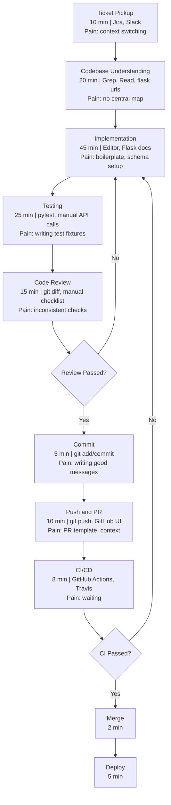

# Development Workflow Map

## Mermaid Flowchart

## Step Annotations

| Step | Time (min) | Tools | Pain Points |
|------|-----------|-------|------------|
| Ticket Pickup | 10 | Jira, Slack | Context switching, understanding requirements |
| Codebase Understanding | 20 | Grep, Read, flask urls | No central map, scattered docs |
| Implementation | 45 | Editor, Flask/Marshmallow docs | Boilerplate for schemas, auth decorators |
| Testing | 25 | pytest, WebTest, manual API | Test fixture setup, coverage gaps |
| Code Review | 15 | git diff, manual checklist | Inconsistent, misses convention violations |
| Commit | 5 | git | Writing informative commit messages |
| Push and PR | 10 | git, GitHub UI | PR template, adding context |
| CI/CD Wait | 8 | GitHub Actions, Travis | Passive waiting |
| Merge and Deploy | 7 | GitHub, server | Low friction once CI passes |

**Total cycle time per feature: approximately 145 minutes (including rework loops)**

## Where AI Automation Helps

The three biggest automation wins (marked below) reduce the cycle from 145 min to around 42 min for a typical feature:

- **Codebase Understanding** (20 min -> 3 min): `/onboard` maps the architecture instantly
- **Code Review** (15 min -> 1 min): `/review` checks all conventions against CLAUDE.md
- **Testing + Commit + PR** (40 min -> 7 min): `/test-gen` + `/ship` handles the end-of-feature grind
